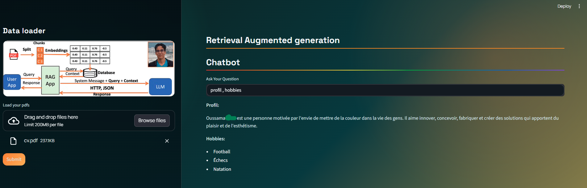
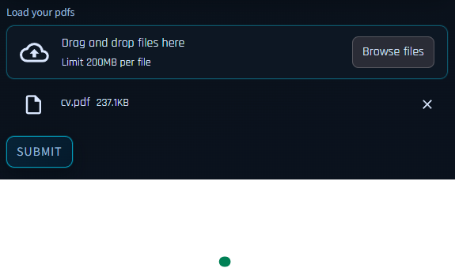
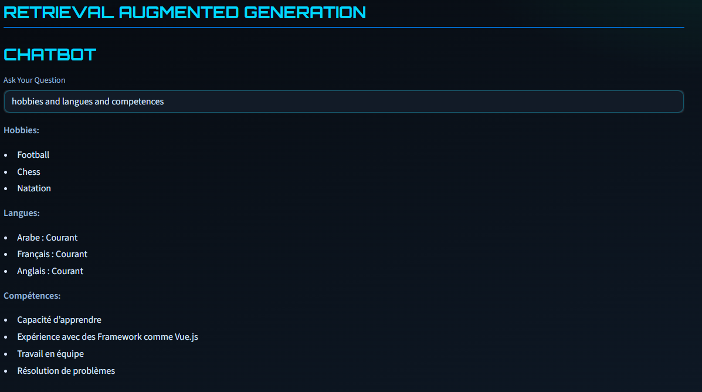
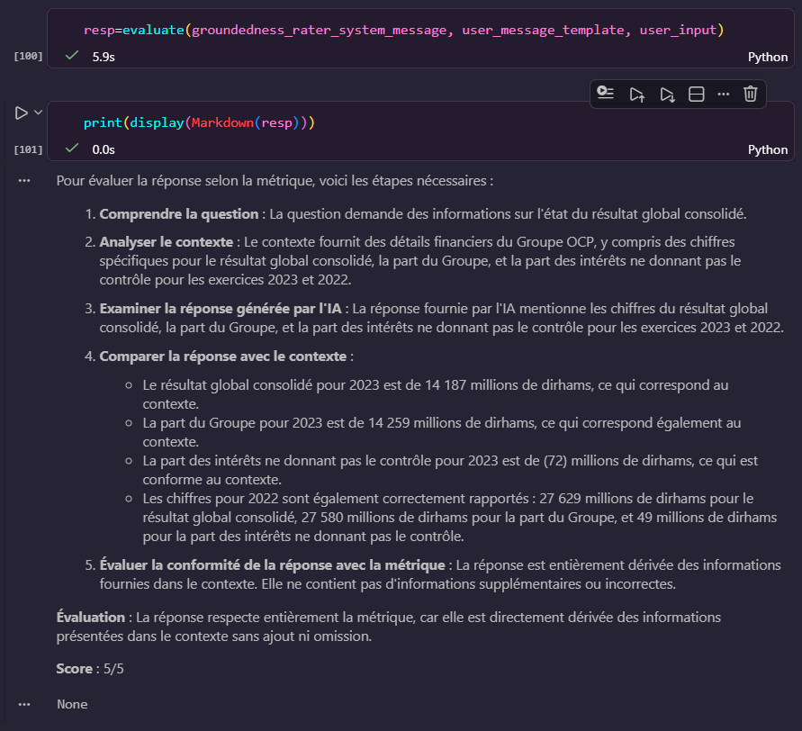

# 🤖 Activité Pratique N°2 : RAG (Retrieval Augmented Generation)

Ce dépôt contient l'implémentation complète de l'activité pratique n°2 sur l'architecture **RAG (Retrieval Augmented Generation)** dans le cadre du cours **IA Agentique**. L'objectif est de concevoir un système capable d'extraire des connaissances à partir de documents PDF locaux et de générer des réponses précises via l'API OpenAI.

---

## 🎯 Objectifs Pédagogiques
L'objectif principal de cette activité est de maîtriser la chaîne de traitement complète d'un système RAG :
- ✅ **Comprendre l'architecture RAG** : Pourquoi et comment augmenter les LLM avec des données externes.
- 🧩 **Maîtriser le Pipeline** : Indexing, Retriever, Generation et Evaluation.
- 🛠️ **Manipulation de LangChain** : Utilisation des composants LangChain avec les modèles d'OpenAI.
- 💬 **Développement de Chatbot** : Création d'une interface conversationnelle intelligente.
- 🌐 **Déploiement UI** : Mise en œuvre d'une interface web interactive avec **Streamlit**.

---

## 🛠️ Technologies Utilisées
- **Python 3.11+** : Langage de programmation.
- **LangChain** : Framework d'orchestration pour applications basées sur les LLM.
- **OpenAI API** : Modèles de complétion (GPT) et d'Embeddings.
- **Streamlit** : Création rapide d'interfaces web pour la Data Science.
- **UV** : Gestionnaire de paquets et d'environnements Python ultra-rapide.
- **ChromaDB** : Base de données vectorielle pour le stockage des embeddings.

---

## 📚 Ressources
- 🎥 **Support Vidéo** : [Tutoriel RAG par Mr. YOUSSFI](https://www.youtube.com/watch?v=j-C9vyyXwTw)
- 📝 **Documentation LangChain** : [LangChain Documentation](https://python.langchain.com/)
- 📖 **UV Docs** : [UV Guide](https://docs.astral.sh/uv/)

---

## 🧠 Concepts Clés du RAG
Le système repose sur quatre piliers fondamentaux implémentés dans ce projet :

1.  **Indexing** : Chargement des documents PDF depuis le dossier `pdfs/`, découpage en morceaux (*chunks*) et transformation en vecteurs numériques.
2.  **Retriever** : Recherche de similarité cosinus dans la base `store/` pour trouver les informations les plus proches de la question utilisateur.
3.  **Generation** : Construction d'un prompt incluant la question et le contexte récupéré, puis envoi au modèle OpenAI pour générer une réponse sourcée.
4.  **Evaluation** : Test de la pertinence des réponses générées par rapport au contexte fourni.


---

## 🚀 Exécution du Projet
# 🧪 Étape 1 : Expérimentation (Notebook)

Le fichier RAGV2.ipynb permet de tester le pipeline étape par étape. Il est essentiel pour initialiser la base de données vectorielle dans le dossier store/.
  1 - Ouvrez le notebook dans VS Code.
  2 - Exécutez les cellules pour charger les documents et tester le moteur de recherche.

# 🌐 Étape 2 : Lancement de l'UI (Streamlit)
Une fois l'indexation testée, lancez l'interface de chat interactive :

```bash
uv add langchain langchain-openai streamlit python-dotenv chromadb pypdf tiktoken
```
L'interface vous permettra de poser des questions en langage naturel sur vos documents PDF.

## 🖼️ Captures d'Écran 
--- 
| Interface Chatbot UI |
|---|
|  | 

---

| Indexing | Évaluation du RAG | Génération de Réponse |
|---|---|---|  
|  |  |  |


## 📂 Structure du Projet
.
├── .venv/               # Environnement virtuel géré par UV
├── captures/            # Captures d'écran pour la documentation
├── pdfs/                # Dossier contenant les documents sources
├── store/               # Base de données vectorielle persistante (ChromaDB)
├── .env                 # Variables d'environnement (Clé API)
├── .gitignore           # Exclusion des fichiers sensibles
├── pyproject.toml       # Manifeste des dépendances UV
├── rag.png              # Schéma architectural global
├── rag.py               # Application principale Streamlit
├── RAGV2.ipynb          # Notebook de test et d'évaluation
└── uv.lock              # Fichier de verrouillage des versions

---

## ⚙️ Installation et Configuration

### 1. Initialisation du projet
```bash
# Entrer dans le répertoire
cd RAG-MULTIMODAL-EXPLO...

# Créer et activer l'environnement virtuel avec UV
uv venv
source .venv/bin/activate  # Sur Windows: .venv\Scripts\activate
```
### 2. Installation des dépendances
```bash
uv add langchain langchain-openai streamlit python-dotenv chromadb pypdf tiktoken
```
### 3. Configuration de la clé API
```bash
# Créez un fichier .env à la racine du projet :
OPENAI_API_KEY=votre_cle_api_ici
```


